# Objective
## Configure and Test NAT Gateway

   This Lab walks you through creating a two Linux VM with Public IP and Private IP. 
   You will be able to connect to Private Linux VM using SSH from the Public Linux VM and access internet.
   
## References
   * [White papers ](https://cloud.oracle.com/en_US/networking/whitepapers)
   * [Documentation](https://docs.cloud.oracle.com/iaas/Content/home.htm)
   * [Blog](https://blogs.oracle.com/cloud-infrastructure)
   
# Steps

## Task 1 - Login to Oracle Cloud Console

   Use credentials provided by your instructor
   
   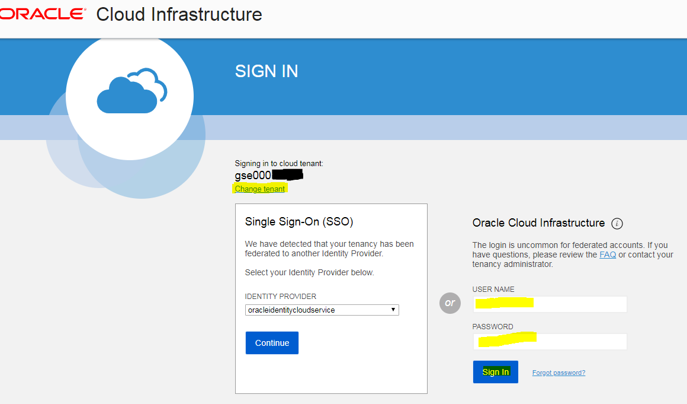
   
   After you login, check to see that you are in us-phoenix-1 region
   
   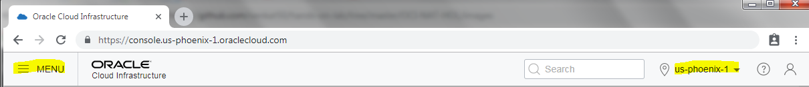

## Task 2 - Create VCN with CIDR BLOCK 172.16.0.0/16

   1. Open the navigation menu. Under Core Infrastructure, go to **Networking** and click **Virtual Cloud Networks**. Ensure that the Demo compartment is selected.
   2. Select **Create Virtual Cloud Network Only** (default)
   3. Enter CIDR BLOCK **172.16.0.0/16**
   4. Scroll to the bottom of the dialog and click **Create Virtual Cloud Network**
   
   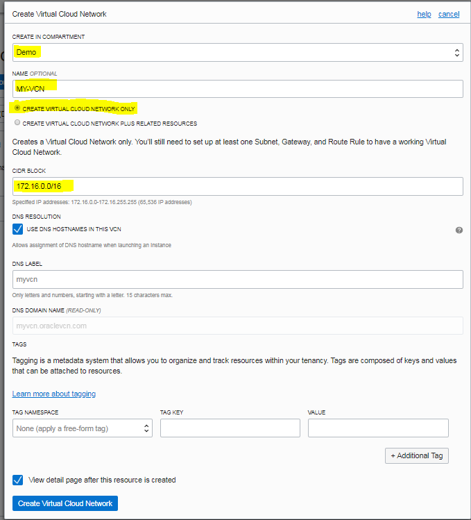


## Task 3 - Create Internet Gateway and NAT Gateway

   1. Select **Internet Gateways** below **Resources** and Create
   
      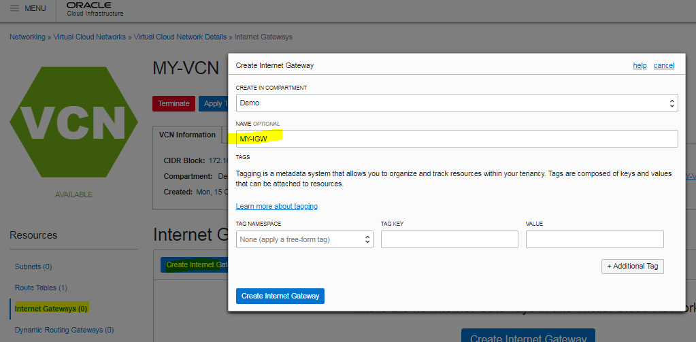
      
   2. Select **NAT Gateways** below **Resources** and Create
   
      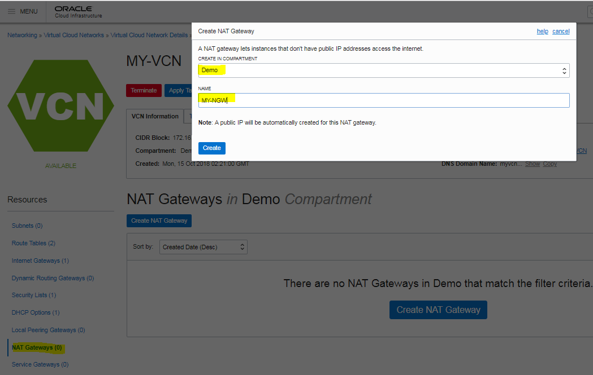
      
## Task 4 - Create Route Tables and Subnets

   1. Create a Public Route Table using Internet Gateway as Target with Destination CIDR Block 0.0.0.0/0
      Select **Route Tables** below **Resources** and Create
   
      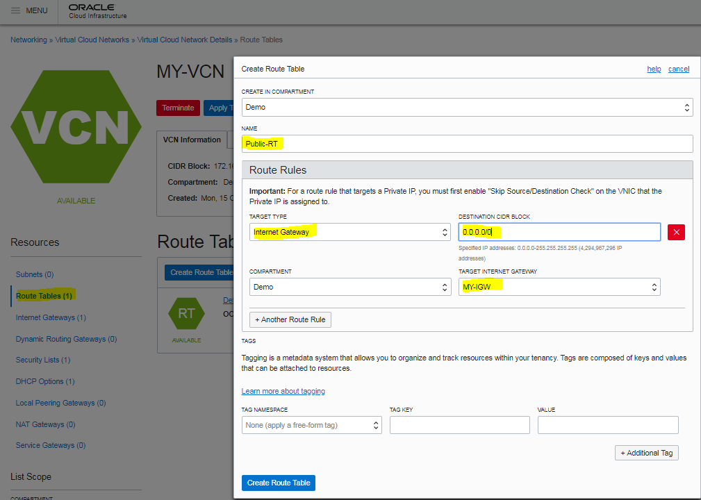
      
   2. Create a Private Route Table using NAT Gateway as Target with Destination CIDR Block 0.0.0.0/0
      Select **Route Tables** below **Resources** and Create
      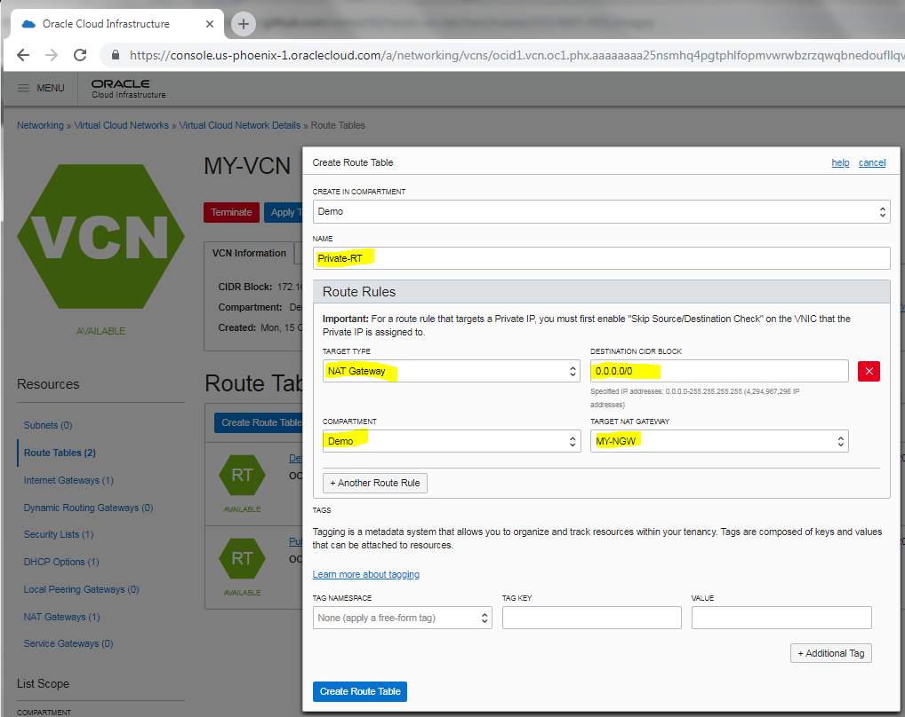
      
## Task 5 - Create public subnet for 172.16.10.0/24

   1. Select **Subnets** below **Resources** and Create
   2. Specify name with a prefix refering to the Availability Domain you select - say **-AD1** for Availability Domain 1.
   3. CIDR BLOCK 172.16.10.20/24
   4. ROUTE TABLE Select the Public Route Table you created earlier.
   5. Ensure **Public Subnet** is selected.
   
   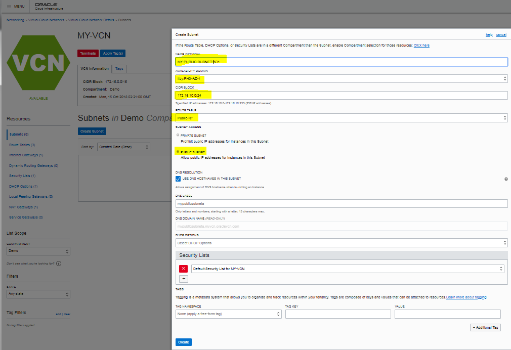

## Task 6 - Create private subnet for 172.16.20.0/24

   1. Select **Subnets** below **Resources** and Create
   2. Specify name with a prefix refering to the Availability Domain you select - say **-AD2** for Availability Domain 2. Note you can create Private subnet in the same Availability Domain as Public subnet but here you can see the latency between Availability domains.
   3. CIDR BLOCK 172.16.10.20/24
   4. ROUTE TABLE Select the Private Route Table you created earlier.
   5. Ensure **Private Subnet** is selected.
   
   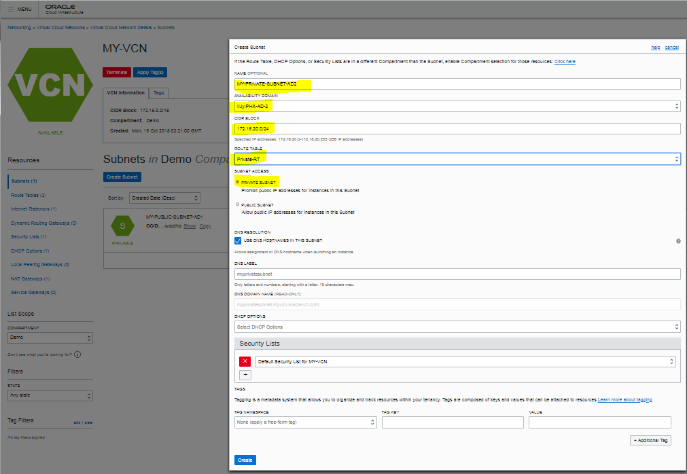

   
## Task 7 - Create private Linux instance

   1. Open the navigation menu. Under Core Infrastructure, go to **Compute** and click **Instances**. Ensure that the Demo compartment is selected.
   2. Create Instance using "VM Standard 1.2" shape, select Availability Domain with private subnet and ensure you select the correct VCN. Note that there are two ways to add ssh keys. Here we demonstrate "browsing" the local filesystem where you have copied ssh keys provided by instructor. Select the id_rsa.pub (public ssh key)
   
   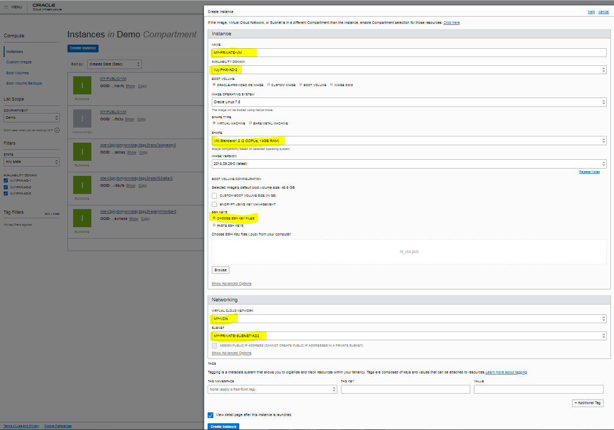


## Task 8 - Create public Linux instance

   1. Open the navigation menu. Under Core Infrastructure, go to **Compute** and click **Instances**. Ensure that the Demo compartment is selected.
   2. Create Instance using "VM Standard 1.2" shape, select Availability Domain with public subnet and ensure you select the correct VCN. Note that there are two ways to add ssh keys. Here we demonstrate second option to "paste" the key contents ssh keys provided by instructor (id_rsa.pub)
   
   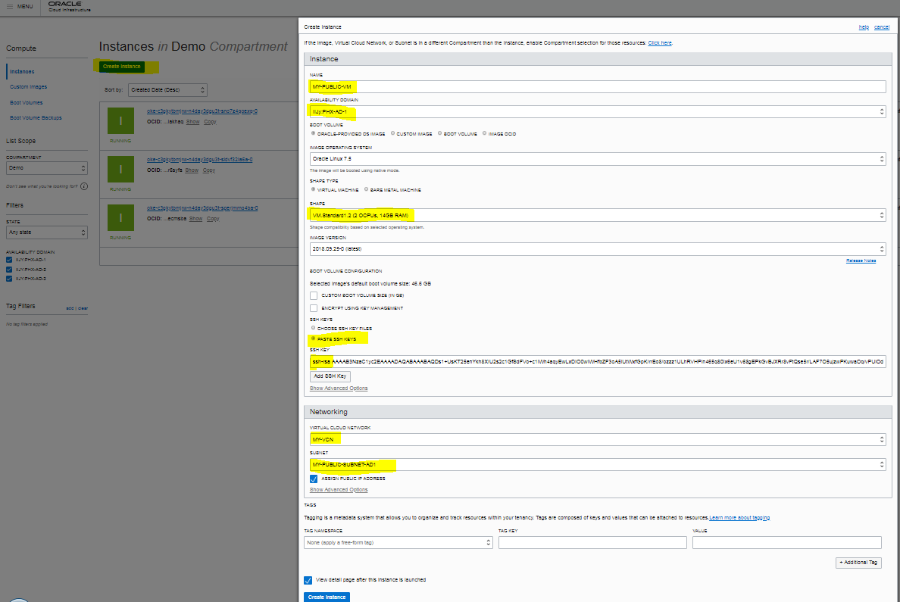


## Task 9 - Test internet connectivity in private linux instance

   1. Connect to Public VM using ssh with public IP address displayed on the insance details using user **opc**
   
      ```shell
      ssh -i keys/id_rsa opc@129.XXX.XX.XX // substitute public IP of the instance 129.XXX.XXX.XX
      ```
      *Note*: Windows users configure Putty to connect to instance.
      
    2. Copy the private key (id_rsa) to the public instance (using scp or winscp)
       ``` shell
       scp -i keys/id_rsa keys/id_rsa opc@129.XXX.XX.XX:.ssh
       ```
       
    3. From the public instance, ssh to login to private instance using private ip address 172.16.XX.XX
       ```shell
       ssh opc@172.16.XX.XX
       ```
       After successful login, you should be able to ping www.oracle.com
       ```shell
       ping www.oracle.com
       ```

## Task 10 - Test NAT Block Traffic

   1. Select NAT gateway you created. You can access NAT Gateway from VCN using the link displayed in public or private compute Instance or via the navigation menu -> Core Infrastructure -> Networking -> Virtual Cloud Networks.
   2. Select the action menu "..." three dots displayed on the right. Select "Block Traffic". You should see the NAT gateway icon display "Blocked".
   3. If you are still connected to the private instance, try ping www.oracle.com. Ping will not work.
   4. Use the NAT gateway action menu "..." (three dots) and select "Allow Traffic".
   5. Now ping will work again as internet connectivity is restored.
   
   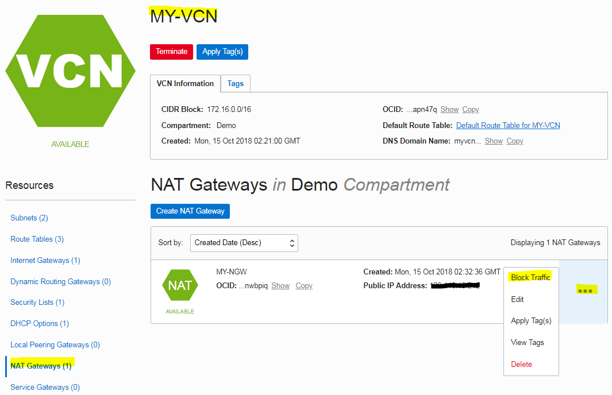
   
   
   


   
   
  
 
  
  

